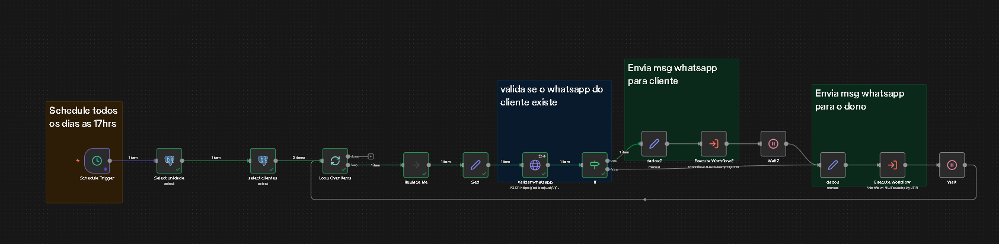
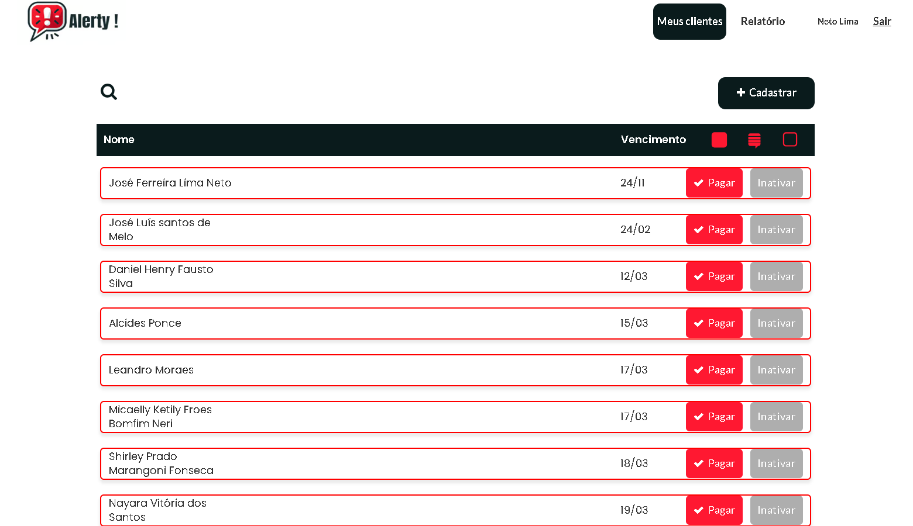
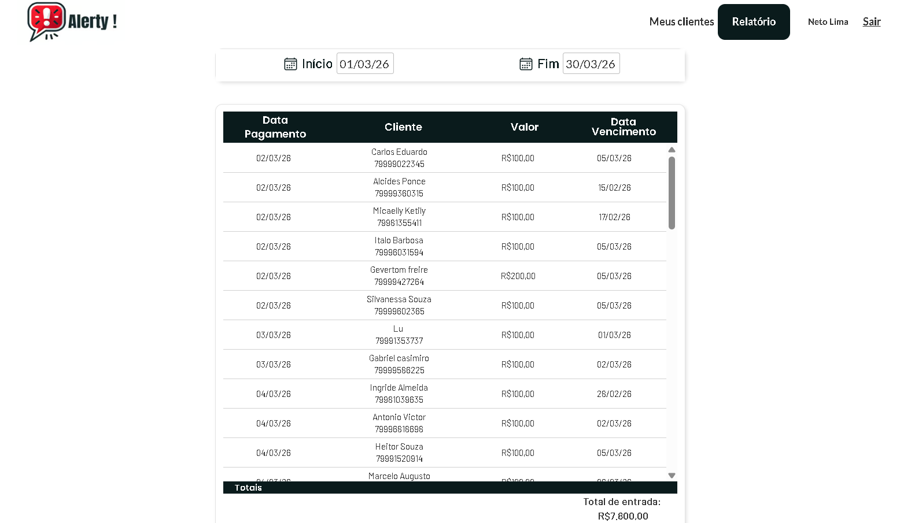

# Alerty - Sistema SaaS de Gestão de Matrículas e Notificações

O **Alerty** é um sistema SaaS desenvolvido para academias e centros de treino com foco na automação do controle de vencimentos, gestão de clientes e comunicação com alunos.

> Sistema em produção com usuário ativo e pagante

---

## Problema

Academias frequentemente enfrentam dificuldades em:

- Controlar vencimentos de matrícula
- Reduzir inadimplência
- Manter comunicação ativa com alunos
- Organizar pagamentos manualmente

Esses fatores impactam diretamente a receita e a operação do negócio.

---

## Solução

O Alerty automatiza a gestão de alunos e vencimentos, permitindo:

- Classificação automática de status (vencido, vence hoje, em dia)
- Controle de pagamentos
- Registro de histórico financeiro
- Automação de notificações via integração com serviços externos

---

## Arquitetura do Sistema
Frontend (Bubble)
↓
Banco de Dados (PostgreSQL / Supabase)
↓
n8n (Automação e regras de negócio)
↓
APIs externas (validação de WhatsApp e envio de mensagens)

---

## Tecnologias Utilizadas

- Frontend: Bubble.io (no-code)
- Backend / automação: n8n
- Banco de dados: PostgreSQL / Supabase
- Integrações: APIs externas (mensageria e validação de WhatsApp)

---

## Funcionalidades

### Gestão de Clientes

- Cadastro completo de alunos
- Upload de foto
- Cadastro de telefone
- Multi seleção de modalidades
- Controle de data de vencimento

---

### Classificação automática

Os alunos são classificados automaticamente com base na data de vencimento:

- Vencido
- Vence hoje
- Em dia

Com priorização visual dos casos mais críticos.

---

### Controle de pagamentos

- Confirmação de pagamento via interface
- Atualização automática da próxima data de vencimento
- Registro histórico de pagamentos

---

### Relatórios

- Listagem de pagamentos realizados
- Filtro por período
- Visualização de valores recebidos
- Totalização de receita

---

### Busca

- Busca por nome de aluno
- Interface otimizada para operação rápida no dia a dia

---

## Automação e Backend (n8n)

O n8n é responsável pela execução das regras de negócio e automações do sistema, funcionando como uma camada de orquestração entre banco de dados e serviços externos.

### Responsabilidades:

- Processamento de dados de vencimento
- Execução de rotinas automáticas (agendamento diário)
- Integração com APIs externas
- Disparo de notificações
- Orquestração de fluxos de dados

---

## Fluxo de Automação

### Lógica do fluxo

1. Um agendamento (cron) executa diariamente às 17h  
2. O sistema busca todas as unidades cadastradas  
3. Para cada unidade, recupera os alunos ativos  
4. Filtra alunos com vencimento próximo (ex: próximo dia)  
5. Para cada aluno, o sistema consulta uma API externa para verificar se o número possui WhatsApp ativo  

6. Com base no retorno da API:
   - Se possuir WhatsApp:
     - Envia notificação para o aluno
     - Envia notificação para o responsável (dono)
   - Caso não possua:
     - Envia notificação apenas para o responsável

Esse fluxo garante confiabilidade na comunicação e evita falhas em cenários de dados incompletos.

O fluxo foi projetado com fallback de comunicação, garantindo robustez e continuidade operacional.

---

## Fluxo do Sistema

1. Usuário cadastra um aluno  
2. Dados são armazenados no banco  
3. Sistema classifica automaticamente o status  
4. Automação (n8n) processa notificações  
5. Usuário confirma pagamento  
6. Sistema atualiza o vencimento automaticamente  
7. Registro é armazenado no histórico financeiro  

---

## Desafios Técnicos

- Implementação de lógica de vencimento baseada em datas
- Atualização automática de ciclos de pagamento
- Integração com API externa para validação de WhatsApp
- Implementação de fallback de comunicação
- Orquestração entre frontend, banco e automações
- Modelagem de dados para histórico financeiro
- Garantia de consistência dos dados

---

## Resultados

- Sistema em produção
- Usuário ativo e pagante
- Automatização de processos manuais
- Redução de erros operacionais

---

## Screenshots

### Dashboard de Clientes

### Cadastro de Cliente

### Confirmação de Pagamento

### Relatórios

---

## Próximos Passos

- Implementar API própria em .NET para centralização das regras de negócio
- Criar arquitetura multi-tenant
- Adicionar dashboard analítico
- Melhorar sistema de autenticação
- Integrar pagamentos reais (Pix)

---

## Autor

Desenvolvido por Neto Lima

Experiência com automações, integrações e construção de sistemas orientados a processos.

---

## Observação

Este projeto foi desenvolvido com foco em resolver um problema real e já está sendo utilizado em ambiente de produção.
